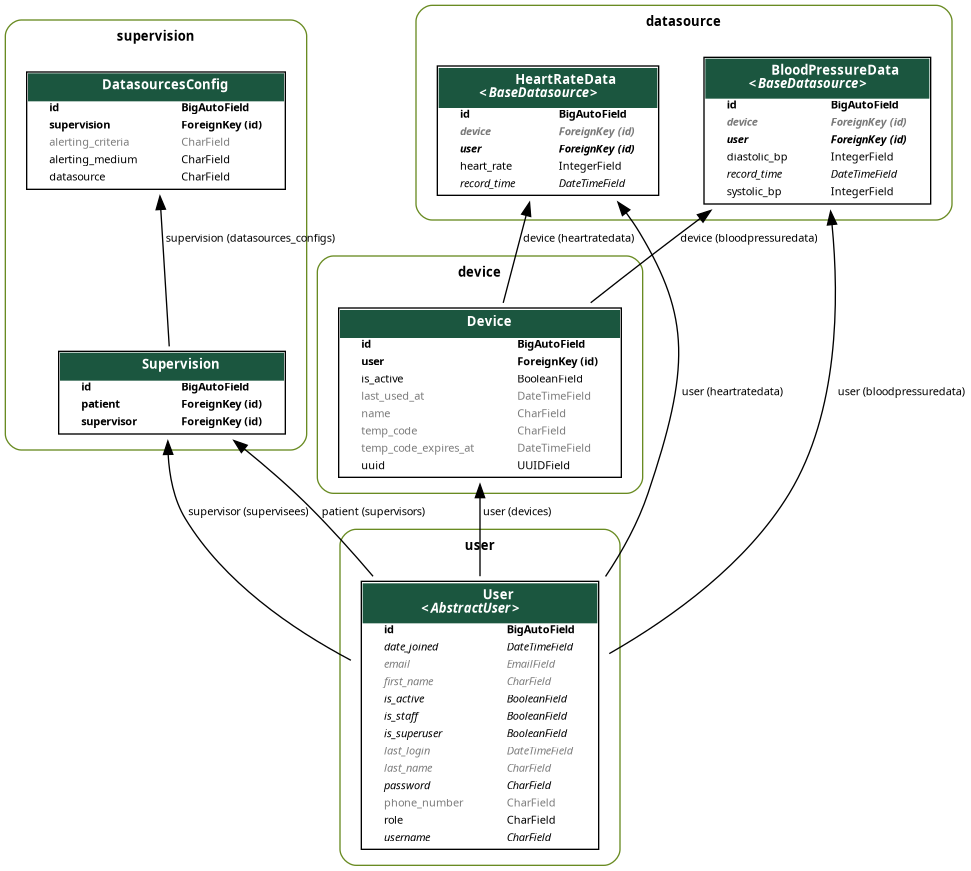
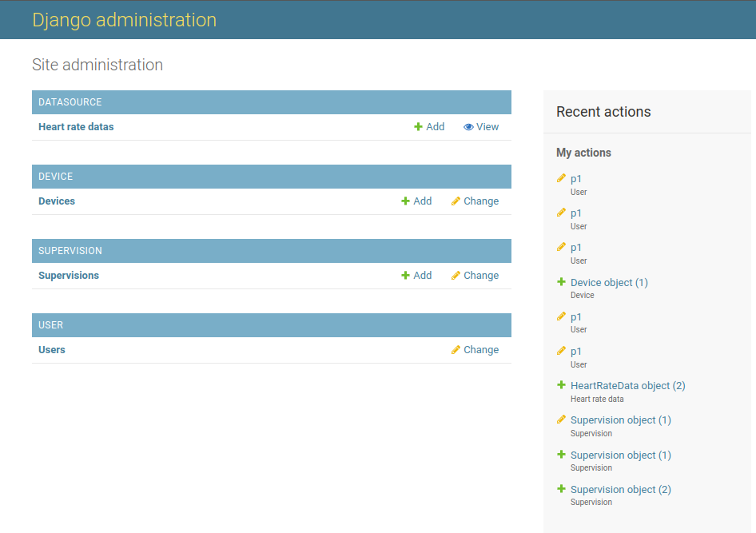
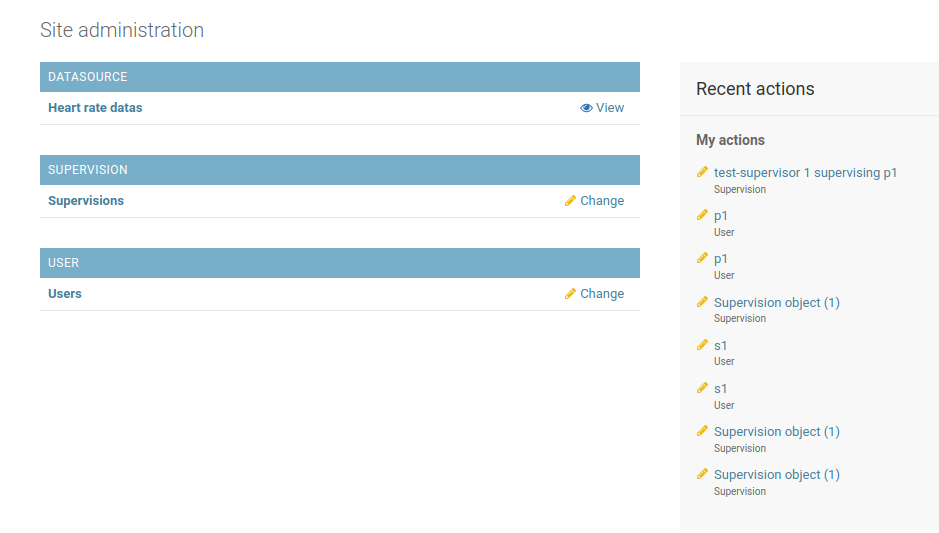
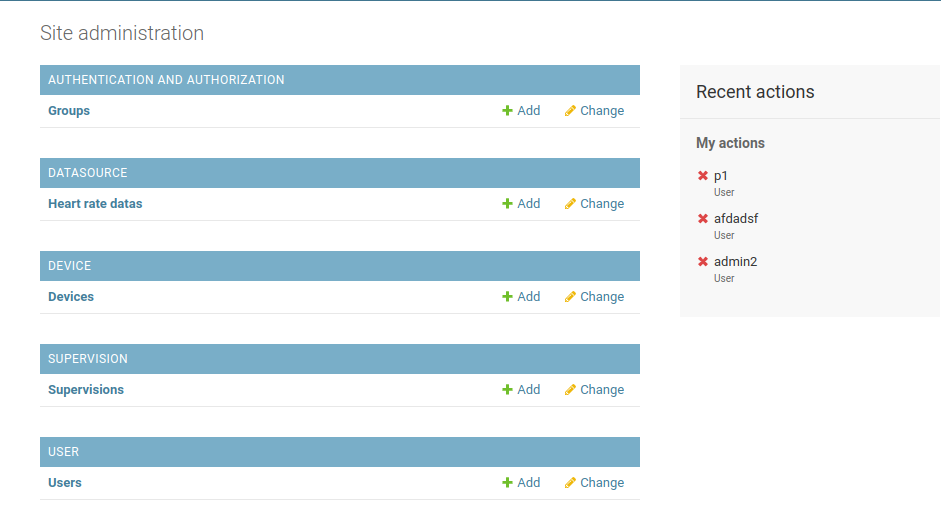
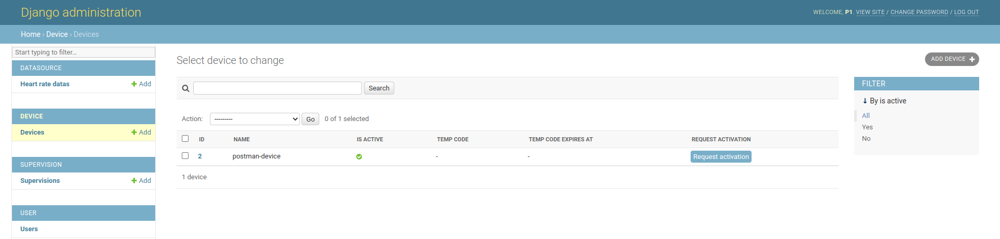
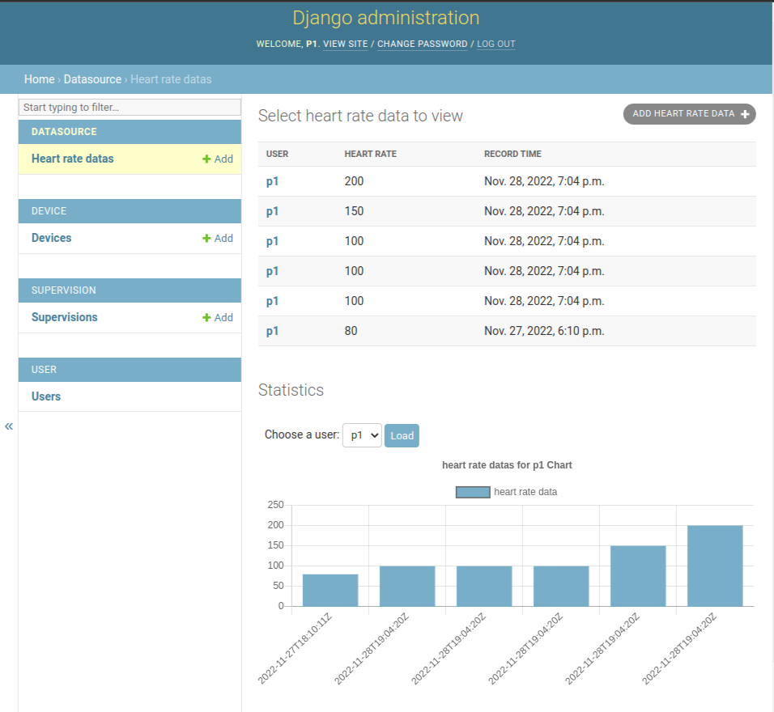
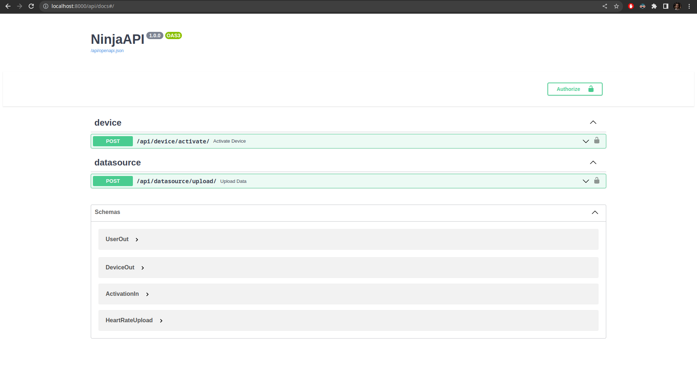

# Patient Sensor System

## Apps
When a project is implemented through a Django project, usually the logic is divided into several modules called "Apps". Each app encapsulates a specific functionality of the system.

This project is consisted of 4 apps to deliver the required functionalities:

1. **User**: This app is responsible for the user management. Each user in our system can have the following roles:
   1. System admin: The user with the ultimate power in the system with the ability to create/read/update/delete any record of any entity; doesn't take part in the system's workflows but can help the maintenance of the system.
   2. Patient: The user who uploads his health related sensor data to the system and asks supervisors to review them and be alerted when sensor data abnormalities are detected.
   3. Supervisor: The user who reviews the sensor data uploaded by patients and can be alerted when sensor data abnormalities are detected.
   Although this app only manages the users. The functionalities explained for the roles is implemented through the other apps in the system.
2. **Datasource**: This app defines the various types of sensor data that can be uploaded by the patient users to the server and implements the ways this job can be done.
3. **Device**: Each patient uses one or multiple devices which collect the sensor data and are going to upload them to the server. Through this app and its utilities, users can link their devices to their accounts in the system and manage them.
4. **Supervision**: When a patient asks a supervisor to observe his sensor data, a relation of "Supervision" is created between the patient and the supervisor. The patients select a range of sensor types that they want to be observed by the supervisor and then the supervisors can select the medium through which they want to be alerted and the criteria that distinguishes whether the data is normal or abnormal.
5. **Permissions**: This is an internal app and users don't interact with it directly; it neither defines any models. This app captures the logic of access control in the system and limits users' access to each other's records. For example this app dictates that the supervisors shouldn't be able to see the sensor data records of a user who is not under their supervision.

Database tables/entities in Django are called "Models". Each app defines a set of models and the relations between them. Studying each system's entities can help us understand the system's functionalities better.

## Entities

Entitiy Relation Diagram (ERD) of the system

### User

A user in the system.

### Device

A device that is used by a user to collect sensor data. User would have to do the linking between the system and the device so the device would know how to introduce itself when it's uploading the data and the system would know which user is the owner of the device and data.

Since sensor data collection devices can be very simple embedded systems with severe limitations on user interaction methods, we designed the device linking mechanism in a way that it would require the least complex interaction from the user. The user would only have to either enter a 9 character code to the device or scan a QR code encoding that 9 character code (still not implemented) that is shown on his dashboard and the device could use it to introduce itself to the system and the system would respond the necessary data for the future communication. The fields `temp_code` and `temp_code_expires_at` are used for this purpose.

### HeartRateData

An example sensor data table that would record heart rate data of a user. The data is recorded in a time series fashion and each record is associated with a user and a device.

Other sensor data tables can be defined as well under the `datasource` app.

### Supervision

A relation between a patient and a supervisor.

### DatasourcesConfig

Each supervision has multiple sensor data types that are going to be observed by the supervisor. This table records the configurations of each sensor data type used in a supervision and its alerting settings such as "alerting criteria" and "alerting medium".
"alerting criteria" stores the expression that is going to be evaluated to determine whether the data is normal or abnormal. "alerting medium" stores the medium through which the supervisor wants to be alerted when the data is abnormal.

## Dashboard

The main interface for the supervisors and patients is the dashboard website. It implements different interface and access rules for each role.

Patient dashboard

Supervisor dashboard

Admin dashboard

Admin user has full control over all models and can change any record in any table. Other can only see their related records in each section. For example in the "Users" section they can only see their own user record and can change their user settings by navigating to it.

In some special sections, users can use some special features other than viewing the records and modifying them. For example in the "Devices" section, patients can link their devices to their accounts by clicking on the "Request activition" button on each device record.

Another example would be the sections under "Datasource" app (e.g. "Heart Rate Data") where supervisors and patients can see the chart visualization of the sensor data uploaded.

## APIs

Although the main user interface is the dashboard website, implementation of the APIs is a required feature in order to enable devices to have the necessary communication with the server. The APIs are implemented Django-Ninja framework and are documented using Swagger.

In the swagger page is constructed according to the OpenAPI specification of the app's endpoints. The specification is generated automatically by the framework everytime the app is launched. Every information that is visible in the swagger page is embedded in the specification file.
API consumers by viewing the swagger page can see the available endpoints and their parameters and can test them directly from the page. They can also see the available authentication methods, the response codes, the request/response bodies' schemes, deprecated endpoints/parameters and many other useful information.

